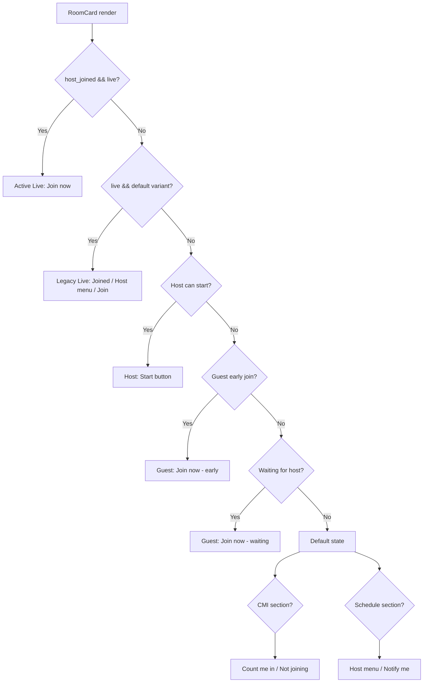

# Talk Room — Tài liệu logic hiện tại (Frontend)

> Cập nhật theo codebase tại `src/hooks/TalkRoom`, `src/Components/TalkRoom`, `src/Container/TalkRoom`.

---

## Mục lục

1. [Tổng quan kiến trúc](#1-tổng-quan-kiến-trúc)
2. [Luồng Create Talk Room](#2-luồng-create-talk-room)
3. [Trạng thái phòng (Room Status)](#3-trạng-thái-phòng-room-status)
4. [Logic hiển thị RoomCard](#4-logic-hiển-thị-roomcard)
5. [TalkRoomCard (Overview)](#5-talkroomcard-overview)
6. [Các hành động trên card](#6-các-hành-động-trên-card)
7. [Edit & Cancel room](#7-edit--cancel-room)
8. [API endpoints](#8-api-endpoints)
9. [Types quan trọng](#9-types-quan-trọng)
10. [Ghi chú / gap hiện tại](#10-ghi-chú--gap-hiện-tại)

---

## 1. Tổng quan kiến trúc

### Entry points

| Màn hình | File | Mô tả |
|----------|------|-------|
| Talk Room page | `src/app/[locale]/talkroom/page.tsx` → `Container/TalkRoom/TalkRoom.tsx` | Trang chính: profile, stats, danh sách phòng, friend rooms |
| Overview | `src/Container/Overview/Overview.tsx` | Widget compact `TalkRoomCard` + modal create |

### Hooks chính

| Hook | File | Vai trò |
|------|------|---------|
| `useTalkRoom` | `src/hooks/TalkRoom/useTalkRoom.tsx` | Data hub: list, CRUD, CMI, notification, filter, connected users |
| `useCreateTalkRoom` | `src/hooks/TalkRoom/useCreateTalkRoom.tsx` | Form state + validation khi tạo phòng |
| `useTalkRoomSchedule` | `src/hooks/TalkRoom/useTalkRoomSchedule.ts` | Toggle schedule, fetch booking slots, build payload schedules |
| `useEditTalkRoom` | `src/hooks/TalkRoom/useEditTalkRoom.tsx` | Form edit (chỉ sửa được tên) |

### Components card

| Component | File | Dùng ở đâu |
|-----------|------|------------|
| `RoomCard` | `src/Components/TalkRoom/RoomCard/RoomCard.tsx` | Talk Room page — card đầy đủ với footer actions |
| `TalkRoomCard` | `src/Components/TalkRoom/TalkRoomCard/TalkRoomCard.tsx` | Overview — card compact |
| `RoomCardHostActions` | `src/Components/TalkRoom/RoomCardHostActions/` | Popover Edit / Cancel cho host |

### Utils

| File | Vai trò |
|------|---------|
| `src/ultis/talkRoom.ts` | Predicate trạng thái, format text, filter search |
| `src/ultis/talkRoomSchedule.ts` | 4 ngày schedule, duration 20 phút, build ISO datetime |
| `src/apis/talkRoomApis.tsx` | Types + HTTP calls |

---

## 2. Luồng Create Talk Room

### 2.1. Điểm mở modal

```
Talk Room page
  └── CButtonCreate "Create talk room"
        └── ModalCreateTalkRoom (mở trực tiếp)

Overview
  └── Nút "Create talk room" / empty state
        └── ModalCreateTalkRoom

Connected Users / Countries modal
  └── "Create room"
        └── ModalCreateTalkRoom
```

> `ModalTalkRoomWarning` ("Creating a new Talk Room will leave your current room") có handler `handleOpenCreateTalkRoomWarning` trong `TalkRoom.tsx` nhưng **không được gọi** từ UI. Nút create mở thẳng modal.

### 2.2. Chuỗi hook

```
ModalCreateTalkRoom
  └── useCreateTalkRoom({ onClose, onSuccess })
        ├── useTalkRoom()           → languages, categories, onCreateTalkRoom
        └── useTalkRoomSchedule()   → schedule state, booking slots
```

### 2.3. Form fields

| Field | Component | Bắt buộc | Quy tắc |
|-------|-----------|----------|---------|
| `name` | `CInput` | Có | Trim, max 255 ký tự |
| `categorySlugs` | `CCheckboxSelect` | Không | Tối đa **3** category |
| `language_id` | `CRadioSelect` | Có | Chọn 1 ngôn ngữ |
| `level` | `CCheckboxSelect` | Có | Tối thiểu 1, tối đa **2** level |
| Schedule | `ScheduleThisRoom` | Không | Toggle bật/tắt, chọn tối đa 4 ngày |

**Level options** (`levelOptions` từ `common.variable.tsx`):
- `BEGINNER`
- `INTERMEDIATE`
- `ADVANCED`

**Rule xung đột level:** `BEGINNER` và `ADVANCED` **không được chọn cùng lúc**.

### 2.4. Validation

#### `isFormValid` — enable nút Create

Điều kiện **tất cả** phải thỏa:

- `name.trim()` không rỗng
- `language_id` đã chọn
- `level.length` từ 1 đến 2
- Không có BEGINNER + ADVANCED cùng lúc
- `categorySlugs.length <= 3`

#### `validate()` — khi bấm Create

| Lỗi | Message |
|-----|---------|
| Thiếu tên | `Topic name is required` |
| Thiếu ngôn ngữ | `Language is required` |
| Thiếu level | `Level is required` |
| Quá 2 level | `You can only select up to 2 levels` |
| BEGINNER + ADVANCED | `Beginner and Advanced cannot be selected at the same time` |
| Quá 3 category | `You can only select up to 3 categories` |

#### Category vượt giới hạn

Khi user chọn quá 3 category, `CCheckboxSelect` gọi `onMaxSelectedExceeded` → hiện error modal: `"You can only select up to 3 categories"`.

#### Level xung đột

Khi chọn BEGINNER + ADVANCED, form **vẫn cập nhật giá trị** nhưng hiện lỗi inline ngay lập tức. Nút Create bị disable cho đến khi sửa.

### 2.5. Schedule (đặt lịch)

**Constants:**
- Thời lượng phòng: **20 phút** (`TALK_ROOM_DURATION_MINUTES`)
- Số ngày chọn được: **4 ngày** (Today, Tomorrow, +2 ngày tiếp theo)
- Copy UI: `"50 rooms out of 100 schedulable per day"`

**Flow:**

1. Mount `useTalkRoomSchedule` → gọi `GET talkroom/booking-slots`
2. User bật switch **"Schedule this room"** (`scheduleEnabled`)
3. User tick ngày (bỏ qua nếu ngày đó `isFull`)
4. User chọn **From** qua `CScheduleTimePicker`
5. **To** tự tính = From + 20 phút (read-only)
6. Submit: `buildSchedules(dayOptions)` chỉ lấy ngày thỏa:
   - `scheduleEnabled === true`
   - `checked === true`
   - `fromTime` đã chọn
   - Ngày không `isFull`

**Payload schedule:**
```ts
{ schedule_at: string /* ISO */, enabled: true }[]
```

**Default state:**
- `scheduleEnabled` ban đầu = `false`
- Sau `resetForm()` / `resetSchedule()`: `scheduleEnabled = true`, xóa `scheduleByDay`

> Nếu không bật schedule hoặc không chọn ngày/giờ hợp lệ → **không gửi** field `schedules` lên API.

### 2.6. Submit → API

**Hook layer** (`useCreateTalkRoom.handleSubmit`):
```ts
onCreateTalkRoom({
  name: form.name.trim(),
  language_id: form.language_id,
  categorySlugs: form.categorySlugs,
  level: form.level.map(l => l.toLowerCase()), // "beginner", "intermediate", "advanced"
  schedules?: [...] // chỉ khi có ít nhất 1 schedule
})
```

**API layer** (`useTalkRoom.handleCreateTalkRoom`):
```ts
POST talkroom
{
  name,
  language_id,
  level: string[],
  categories: [{ slug }],
  idempotency_key: generateCustomUuid(),
  schedules?: [{ schedule_at, enabled }]
}
```

**Sau khi thành công:**
- Toast success: `"Your talk room is ready and will start at the time you set"`
- `resetForm()` + đóng modal
- `onSuccess` callback → refresh analysis + list (từ `TalkRoom.tsx`)

### 2.7. Data load khi mount `useTalkRoom`

| API | Mục đích |
|-----|----------|
| `GET talkroom/my-status` | Stats user (TalkRoomStats) |
| `GET language` | Danh sách ngôn ngữ |
| `GET talkroom/categories` | Danh sách category |
| `GET talkroom` | Danh sách tất cả phòng |
| `GET talkroom/friend-rooms` | Phòng có bạn bè |

> API `GET validation/can-create-room` (`canCreateTalkRoom`) **đã define nhưng chưa được gọi** ở UI.

---

## 3. Trạng thái phòng (Room Status)

Frontend **không có enum status cố định**. Status là `string` từ API.

### Các khái niệm chính

| Khái niệm | Điều kiện | Ý nghĩa UI |
|-----------|-----------|------------|
| **Live** | `status === 'live'` | Phòng đang live |
| **Live + host joined** | `status === 'live'` && `host_joined === true` | Host đã vào → session active |
| **Scheduled** | Không live | Hiển thị `next_schedule_at` / `started_at` |
| **Host room** | `is_your_room === true` | User hiện tại là host |
| **Joined** | `is_joined === true` | User đã join phòng live |
| **CMI** | `is_cmi === true` | User đã "Count me in" |
| **Notified** | `user_notified === true` | User đã bật thông báo |

### Thời gian quan trọng

```ts
getTalkRoomScheduledStartAt(room)
  → room.started_at ?? room.next_schedule_at
```

**Early access window:** **10 phút** trước giờ bắt đầu (`TALK_ROOM_EARLY_ACCESS_MINUTES`).

```ts
isTalkRoomWithinEarlyAccessWindow(scheduledAt)
  → now >= scheduledAt - 10 phút

isTalkRoomScheduledStartTimePassed(scheduledAt)
  → now >= scheduledAt
```

### Predicate helpers (`ultis/talkRoom.ts`)

| Hàm | Điều kiện |
|-----|-----------|
| `isTalkRoomLive(status)` | `status === 'live'` |
| `isTalkRoomLiveWithHostJoined(room)` | live && `host_joined === true` |
| `isTalkRoomHostCanStart(room)` | `is_your_room` && `!host_joined` && có `scheduledAt` && trong early window |
| `isTalkRoomGuestCanJoinEarly(room)` | `!is_your_room` && `!host_joined` && trong early window && **chưa** đến giờ bắt đầu |
| `isTalkRoomWaitingForHost(room)` | `!is_your_room` && `!host_joined` && **đã** qua giờ bắt đầu |

---

## 4. Logic hiển thị RoomCard

`RoomCard` là component chính. Footer được chọn theo **thứ tự ưu tiên** — trạng thái đầu tiên match sẽ render, các trạng thái sau bị bỏ qua.

### 4.1. Header (chung mọi trạng thái)

- **Friend banner** (chỉ `variant="friend"`): `"X is here, waiting for you..."` / `"X and Y are staying in this room!"`
- Tên phòng + category labels
- Tags: cờ + tên ngôn ngữ, level tags
- Nút **Share** (`dynamic_link` → Web Share API hoặc clipboard)
- `TalkRoomAvatarGroup`: avatar speakers (hoặc host nếu chưa live và không có speakers)

### 4.2. Decision tree footer

```
┌─ 1. ACTIVE LIVE (ưu tiên cao nhất)
│     isTalkRoomLiveWithHostJoined(room)
│     → 🔴 Live icon + "X/Y people in room" + [Join now]
│
├─ 2. LEGACY LIVE (chỉ variant="default")
│     status === 'live' && host_joined !== true
│     && không match 1, 3, 4, 5
│     → 👥 Tên speakers / số người
│     → is_joined:     [Joined] (disabled)
│     → is_your_room:  "You're host" + [Edit/Cancel menu]
│     → else:          [Join]
│
├─ 3. HOST CAN START (chỉ variant="default")
│     isTalkRoomHostCanStart(room)
│     → 📅 "Start at HH:MM DD/MM" + [Start]
│
├─ 4. GUEST EARLY JOIN (chỉ variant="default")
│     isTalkRoomGuestCanJoinEarly(room)
│     → 📅 "Start at ..." + [Join now]
│
├─ 5. GUEST WAITING FOR HOST (chỉ variant="default")
│     isTalkRoomWaitingForHost(room)
│     → 📅 "Start at ..." + "X/Y people are waiting" + [Join now]
│
└─ 6. DEFAULT (scheduled / pre-live)
      Có thể hiện TỐI ĐA 2 hàng:
      
      A) CMI section (showCmiSection):
         !live && không match 1-5
         && (total_cmi > 0 || !is_your_room)
         → 👥 CMI text hoặc "Join the talk with us"
         → !is_your_room:
              is_cmi ? [Not joining] : [Count me in]
      
      B) Schedule section (showScheduleSection):
         có scheduleText && !live && không match 1,3,4,5
         → 📅 "Start at ..."
         → is_your_room: "You're host" + [Edit/Cancel menu]
         → else: [Notify me] / [Notify on]
```

### 4.3. Chi tiết từng trạng thái footer

#### Trạng thái 1 — Active Live

| Điều kiện | `status === 'live'` && `host_joined === true` |
|-----------|-----------------------------------------------|
| Meta | `{total_participants}/{max_participants} people in room` |
| Button | **Join now** |
| Variant friend | ✅ Hiển thị |

#### Trạng thái 2 — Legacy Live

| Điều kiện | `status === 'live'` && `host_joined !== true` |
|-----------|-----------------------------------------------|
| Meta | Tên speakers (tối đa 3) + "X others are in the room" |
| Guest đã join | **[Joined]** (disabled) |
| Host | Badge "You're host" + menu Edit/Cancel |
| Guest chưa join | **[Join]** |
| Variant friend | ❌ Bỏ qua |

#### Trạng thái 3 — Host Can Start

| Điều kiện | Host + `!host_joined` + trong cửa sổ 10 phút trước giờ bắt đầu |
|-----------|---------------------------------------------------------------------|
| Meta | `Start at {hh:mmA DD/MM}` |
| Button | **[Start]** |
| Variant friend | ❌ Bỏ qua |

#### Trạng thái 4 — Guest Early Join

| Điều kiện | Guest + `!host_joined` + trong early window + **chưa** đến giờ bắt đầu |
|-----------|-------------------------------------------------------------------------|
| Meta | `Start at {hh:mmA DD/MM}` |
| Button | **[Join now]** |
| Variant friend | ❌ Bỏ qua |

#### Trạng thái 5 — Guest Waiting For Host

| Điều kiện | Guest + `!host_joined` + **đã** qua giờ bắt đầu |
|-----------|--------------------------------------------------|
| Meta | `Start at ...` + `{X/Y} people are waiting` |
| Button | **[Join now]** |
| Variant friend | ❌ Bỏ qua |

#### Trạng thái 6A — CMI Section (Default)

| Điều kiện hiện section | Không live, không match 1-5, và (`total_cmi > 0` hoặc không phải host) |
|------------------------|------------------------------------------------------------------------|
| Có CMI | Text: `"A, B, C and N others plan to join"` |
| Không CMI | `"Join the talk with us"` |
| Guest + chưa CMI | **[Count me in]** ⭐ |
| Guest + đã CMI | **[Not joining]** |
| Host | Không hiện button CMI |

**CMI text format** (`formatTalkRoomCmiText`):
- ≤ 3 người: liệt kê tên + "plan(s) to join"
- \> 3 người: 3 tên đầu + "and N others plan to join"

#### Trạng thái 6B — Schedule Section (Default)

| Điều kiện hiện section | Có `scheduleText` && không live && không match 1,3,4,5 |
|------------------------|--------------------------------------------------------|
| Host | `"Start at: {time}"` + badge "You're host" + menu Edit/Cancel |
| Guest | `"Start at {time}"` + **[Notify me]** hoặc **[Notify on]** |

**Notify button label:**
- `user_notified === false` → `"Notify me"`
- `user_notified === true` → `"Notify on"`

### 4.4. Friend variant (`variant="friend"`)

Dùng trong section **"Your friends are here"** (`TalkRoom.tsx`).

| Khác biệt | Chi tiết |
|-----------|----------|
| Banner | Hiện friend banner ở đầu card |
| Bỏ qua | Legacy live, Host start, Guest early join, Guest waiting |
| Vẫn hiện | Active live (#1), CMI section, Schedule section |
| Host actions | **Không** truyền `onEditRoom` / `onCancelRoom` trong friend list |

---

## 5. TalkRoomCard (Overview)

Card compact dùng ở `Overview.tsx`, logic đơn giản hơn `RoomCard`.

| Trạng thái | Hiển thị |
|------------|----------|
| `status === 'live'` | Icon live + `Live {total}/{max}` |
| Không live | `formatTalkRoomSchedule(next_schedule_at)` → `hh:mmA DD/MM` |

Click card → flow welcome/rules → navigate `/talkroom?id={roomId}`.

---

## 6. Các hành động trên card

### Đã wired trong `TalkRoom.tsx`

| Action | Handler | API |
|--------|---------|-----|
| Share | `navigator.share` / `clipboard.writeText` | — |
| Count me in | `onCountMeInTalkRoom(id, true)` | `POST talkroom/{id}/count_me_in/toggle` |
| Not joining | `onCountMeInTalkRoom(id, false)` | same |
| Notify me / Notify on | `onNotificationMeInTalkRoom(id, !user_notified)` | `POST talkroom/{id}/notifications/toggle` |
| Edit room | Mở `ModalEditTalkRoom` | `PUT talkroom/{id}` |
| Cancel room | Mở `ModalCancelTalkRoom` → confirm | `DELETE talkroom/{id}` |

**Sau CMI / Notify thành công:** refresh room detail → patch state local + toast success.

**Sau Cancel thành công:** xóa room khỏi list + toast `"Your talk room has been canceled"`.

### Chưa wired

| Action | Ghi chú |
|--------|---------|
| **Join** / **Join now** | `RoomCard` có prop `onJoin` nhưng `TalkRoom.tsx` **không truyền handler** |
| **Start** | `RoomCard` có prop `onStart` nhưng **không truyền handler** |

→ Các nút Join/Start hiện **render nhưng click không làm gì**.

---

## 7. Edit & Cancel room

### Edit (`useEditTalkRoom`)

| Field | Có sửa được? |
|-------|--------------|
| `name` | ✅ Có |
| `language_id` | ❌ Disabled (read-only) |
| `categorySlugs` | ❌ Disabled |
| `level` | ❌ Disabled |
| Schedule | ❌ Read-only (`ScheduleThisRoom readOnly`) |

Chỉ gửi `name` (+ giữ nguyên language/level/category) qua `PUT talkroom/{id}`.

### Cancel

1. Host bấm **Cancel room** trong `RoomCardHostActions`
2. Mở `ModalCancelTalkRoom` xác nhận
3. `DELETE talkroom/{id}`
4. Xóa khỏi list + refresh stats

---

## 8. API endpoints

| Method | Route | Mục đích |
|--------|-------|----------|
| GET | `talkroom/overview` | Overview widget |
| GET | `talkroom/my-status` | User stats |
| GET | `talkroom` | List all rooms (filter: level, language) |
| GET | `talkroom/friend-rooms` | Friend rooms |
| GET | `talkroom/{id}/details` | Room detail |
| POST | `talkroom` | Create room |
| PUT | `talkroom/{id}` | Update room |
| DELETE | `talkroom/{id}` | Cancel/delete room |
| POST | `talkroom/{id}/count_me_in/toggle` | CMI toggle |
| POST | `talkroom/{id}/notifications/toggle` | Notify toggle |
| GET | `talkroom/booking-slots` | Schedule availability |
| GET | `talkroom/categories` | Categories |
| GET | `language` | Languages |
| GET | `talkroom/connected-users` | Connected people |
| GET | `talkroom/connected-countries` | Connected countries |
| GET | `validation/can-create-room` | Can-create check (**chưa dùng**) |

### Filter list (Talk Room page)

| Filter | Cách hoạt động |
|--------|----------------|
| Language | API: `where.language_id.$in` |
| Level | API: `where.level.$overlap` (lowercase) |
| Search | Client-side: filter theo tên phòng, tên host, category text |

---

## 9. Types quan trọng

### `TalkRoomRoom` — model hiển thị card

```ts
{
  id, name, status?,
  level?, language?, categories?,
  speakers?, created_by_user?, host_user?,
  total_participants?, max_participants?,
  next_schedule_at?, started_at?, host_joined?,
  is_your_room?, is_joined?, is_cmi?, user_notified?,
  cmi_users?, total_cmi?,
  joined_friends?, total_friends_joined?,
  dynamic_link?
}
```

### `CreateTalkRoomInput` — hook layer

```ts
{
  name: string
  language_id: string
  categorySlugs: string[]
  level: string[]          // lowercase khi gửi API
  schedules?: { schedule_at: string; enabled: boolean }[]
  idempotency_key?: string
}
```

### `BookingSlotsData` — availability mỗi ngày

```ts
{
  availableCount, totalCount, usedCount,
  isFull: boolean,
  availabilityText: string,  // e.g. "3 spots available" / "Full (50/50). Create live instead"
  timeSlots: string[]
}
```

---

## 10. Ghi chú / gap hiện tại

| # | Vấn đề | Chi tiết |
|---|--------|----------|
| 1 | Join/Start chưa wired | `onJoin`, `onStart` không được truyền từ `TalkRoom.tsx` |
| 2 | `canCreateTalkRoom` unused | Không có gate kiểm tra trước khi mở modal create |
| 3 | `ModalTalkRoomWarning` unused | Handler có nhưng UI bỏ qua, mở thẳng create modal |
| 4 | Không có status enum FE | Chỉ check `'live'` explicitly; các trạng thái khác suy ra từ flags + timestamp |
| 5 | Category optional | Khác với language và level (bắt buộc) |
| 6 | Friend list thiếu Edit/Cancel | Friend `RoomCard` không truyền `onEditRoom` / `onCancelRoom` |

---

## Sơ đồ tổng hợp trạng thái card


