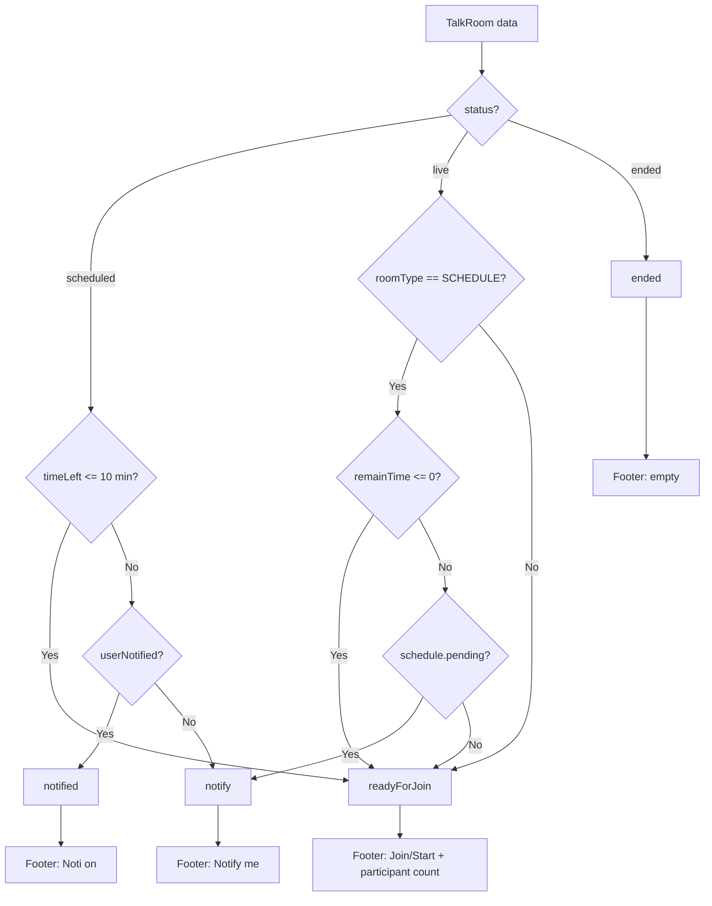

# Rule hiển thị Room Card

Tài liệu này mô tả toàn bộ quy tắc hiển thị **Room Card** trong app Talk Room, dựa trên source code hiện tại.

---

## 1. Component chính

| File | Vai trò |
|------|---------|
| `lib/widget/talk_room_card.dart` | Component card chính — logic trạng thái, layout, hành động |
| `lib/widget/card_host_room.dart` | Cụm avatar host/speaker (góc phải card) |
| `lib/widget/badge_card_view.dart` | Badge ngôn ngữ + level |
| `lib/widget/button/count_me_in_button.dart` | Nút "Count me in" / "Not joining" |
| `lib/widget/button/notify_room_button.dart` | Nút bật/tắt thông báo (dùng trong detail sheet) |
| `lib/widget/people_plan_join_bts.dart` | Bottom sheet danh sách người plan to join |

### Nơi sử dụng `TalkRoomCard`

| Màn hình / View | File | Layout | Props đặc biệt |
|-----------------|------|--------|----------------|
| Tất cả phòng | `lib/view/all_room/all_room_view.dart` | Danh sách dọc | Mặc định |
| Home — bạn bè | `lib/screen/home_talk_room/home_talk_room_screen.dart` | Danh sách ngang | Mặc định |
| Home — tất cả phòng | `lib/screen/home_talk_room/home_talk_room_screen.dart` | Dùng `AllRoomView` | Mặc định |
| Phòng bạn bè | `lib/screen/friend_talk_room/friend_talk_room_screen.dart` | Danh sách dọc | Mặc định |
| Phòng sắp tới | `lib/screen/upcoming_room/upcoming_room_screen.dart` | Danh sách dọc | `isUpcoming: true` |
| Chi tiết phòng (sheet) | `lib/view/room_sheet/talk_room_sheet_detail_view.dart` | Bottom sheet | `isShowDetail: true` |
| Tìm kiếm | `lib/screen/search_all_room/search_all_room_screen.dart` | Dùng `AllRoomView` | Mặc định |

### Mini preview (không phải full card)

`lib/view/home_overview_room_view.dart` hiển thị preview nhỏ trên home feed: 3 cột avatar + badge ngôn ngữ + text Live/lịch. **Không** dùng `TalkRoomCard`.

---

## 2. Constructor & Props

```dart
TalkRoomCard(
  talkRoom: item,              // null = skeleton loading
  accountService: service,     // bắt buộc
  width: null,                 // optional — fixed width cho list ngang
  isUpcoming: false,           // UI footer cho màn Upcoming
  isShowDetail: false,         // chế độ detail bottom sheet
  onDeleteRoom: null,          // chỉ dùng khi isUpcoming
  onToggleAllNotification: null, // chỉ dùng khi isUpcoming
)
```

---

## 3. Trạng thái card (`TalkRoomCardType`)

Card có **4 loại trạng thái**, quyết định nội dung footer và hành vi tap:

| `TalkRoomCardType` | Ý nghĩa |
|--------------------|---------|
| `notify` | Phòng đã lên lịch, còn > 10 phút, chưa bật thông báo |
| `notified` | Phòng đã lên lịch, đã bật thông báo |
| `readyForJoin` | Có thể vào phòng (trong 10 phút trước giờ bắt đầu, hoặc đang live) |
| `ended` | Phòng đã kết thúc |

### Logic xác định `cardType`

**Hằng số quan trọng:** `HOST_TIME_TO_JOIN_FIRST = 10 * 60` giây (10 phút) — định nghĩa tại `lib/constant/app_constant.dart`.

#### Khi `status == scheduled`

```
timeLeft = scheduleAt - now (giây)

if timeLeft <= 600:
  → readyForJoin
else if userNotified == true:
  → notified
else:
  → notify
```

#### Khi `status == live`

```
if roomType == SCHEDULE:
  schedule = scheduleTimes.first
  remainTime = schedule.scheduleAt - now

  if remainTime <= 0:
    → readyForJoin
  else if schedule.status == pending:
    → notify
  else:
    → readyForJoin
else:
  → readyForJoin
```

#### Khi `status == ended`

```
→ ended
```

#### Fallback (các trạng thái khác)

```
if userNotified == true → notified
else → notify
```

---

## 4. Phân nhánh Host vs Listener

```
isHost = accountService.account.userId == talkRoom.hostUser.userId
```

| Hành vi | Host | Listener |
|---------|------|----------|
| Nút "Notify me" | Không hiển thị | Hiển thị khi `cardType == notify` |
| Nút "Noti on" | Không hiển thị | Hiển thị khi `cardType == notified` |
| Nút "Count me in" | Không hiển thị | Hiển thị trong section count-me-in |
| Footer `notify` / `notified` | `_buildHostWaiting()` | `_buildNotifyMe()` / `_buildHasNotificationOn()` |
| Nút Join/Start | Text **"Start"** nếu `!hostJoined` | Text **"Join now"** |
| Menu ⋯ | Edit room / Cancel room | Không có (trừ upcoming) |

---

## 5. Nội dung hiển thị trên card

### 5.1. Luôn hiển thị (khi `talkRoom != null`)

| Phần tử | Nguồn dữ liệu |
|---------|---------------|
| Tên phòng | `talkRoom.name` |
| Categories | `talkRoom.categories` — join slug, capitalize, phân cách bằng `, ` |
| Badge ngôn ngữ | `BadgeCardView` — cờ + tên ngôn ngữ |
| Badge level | Một badge cho mỗi `talkRoom.level` |
| Avatar host/speaker | `CardHostRoom` — góc phải |
| Icon share | Góc phải trên — màu brand orange |

### 5.2. Hiển thị có điều kiện

| Phần tử | Điều kiện |
|---------|-----------|
| **Banner bạn bè đang chờ** | `cardType == readyForJoin` AND `joinedFriends.isNotEmpty` — tên bạn màu cam + text "room here waiting" |
| **Icon chat** (xanh) | `status != live` — tap vào room nếu `readyForJoin`, không thì mở schedule chat |
| **Thời gian bắt đầu** | Hiển thị ở footer và/hoặc detail tùy card type |
| **Section Count me in** | Xem mục 5.3 |
| **Footer actions** | Ẩn hoàn toàn khi `isShowDetail == true` |
| **Divider header/footer** | Chỉ khi `!isShowDetail` |
| **Icon share** | Ẩn khi `isShowDetail == true` |
| **Box shadow** | Ẩn khi `isShowDetail == true` |

### 5.3. Rule `showCountMeIn`

```
isMyRoom = talkRoom.isYourRoom

if isMyRoom:
  show = countMeInList.isNotEmpty
else:
  show = (cardType == notify OR notified)
         AND status != live
```

Trong section count-me-in:
- Nút `CountMeInButton` chỉ hiển thị cho **user khác host** và khi `!isShowDetail`
- Host chỉ thấy danh sách người đã count in (nếu có)

---

## 6. Footer theo từng trạng thái

### 6.1. Chế độ mặc định (`!isUpcoming && !isShowDetail`)

| `cardType` | Listener | Host |
|------------|----------|------|
| `notify` | Thời gian bắt đầu + nút "Notify me" | `_buildHostWaiting` |
| `notified` | Thời gian bắt đầu + nút "Noti on" | `_buildHostWaiting` |
| `readyForJoin` | `_buildJoinStatus` | `_buildJoinStatus` |
| `ended` | `SizedBox()` — footer trống | `SizedBox()` — footer trống |

### 6.2. `_buildJoinStatus` (readyForJoin)

**Trường hợp đặc biệt — host + scheduled + chưa live:**
- Chỉ hiển thị thời gian bắt đầu

**Các trường hợp khác:**
- Thời gian bắt đầu (nếu chưa live)
- Icon trạng thái:
  - `hostJoined == true` → Lottie animation "joining"
  - `hostJoined == false` → Icon audio xanh (đang chờ)
- Text: `{totalParticipants}/{maxParticipants} people in room` hoặc `people are waiting`
- Nút **Start** (host, chưa join) hoặc **Join now**

### 6.3. `_buildHostWaiting` (host đang chờ)

```
if pendingNextSchedule != null:
  remainTime = pendingNextSchedule - now

  if 0 <= remainTime <= 600:
    → _buildHostJoinBeforeLive (thời gian + Start + menu ⋯)
  else if remainTime < 0:
    → _buildJoinStatus
```

**Mặc định (còn > 10 phút):**
- Thời gian bắt đầu
- Badge "You are hosting" (nền brand subtle)
- Menu ⋯ → Edit room / Cancel room

### 6.4. Chế độ Upcoming (`isUpcoming: true`)

Thay footer mặc định bằng `_buildUpcoming()`:
- Thời gian bắt đầu
- Text "Noti on" / "Noti off" (tap để toggle)
- Menu ⋯:
  - Bật/tắt thông báo phòng này
  - Bật/tắt thông báo tất cả phòng
  - Xóa khỏi upcoming list

### 6.5. Chế độ Detail (`isShowDetail: true`)

- Không có box shadow
- Thời gian bắt đầu hiển thị inline dưới badges
- Không có icon share, divider, footer actions
- `CountMeInButton` và `NotifyRoomButton` render **bên dưới** card trong sheet

---

## 7. Hành vi tương tác (Tap)

| Vùng tap | Hành vi |
|----------|---------|
| Toàn card | Vào phòng — **chỉ khi** `cardType == readyForJoin` |
| Icon share | Validate share link → mở invite bottom sheet |
| Icon chat | Vào phòng nếu `readyForJoin`, không thì mở schedule chat |
| Nút Notify me / Noti on | Toggle notification |
| Nút Join / Start | `enterRoom()` → `TalkRoomController.joinRoom()` |
| Avatar (CardHostRoom) | Navigate tới profile user |
| Count me in list | Mở `PeoplePlanJoinBts` |

---

## 8. CardHostRoom — Rule avatar

### Khi nào hiển thị host avatar (fallback)

```
isShowHostWhenEmpty =
  status != live
  AND !isRoomScheduleJoinBeforeLive
```

`isRoomScheduleJoinBeforeLive` = `true` khi phòng scheduled và còn ≤ 10 phút trước giờ bắt đầu.

### Nguồn avatar

1. Dùng `talkRoom.speakers` nếu có
2. Fallback: avatar host khi `isShowHostWhenEmpty == true`

### Layout theo số speaker

| Số speaker | Background SVG | Layout |
|------------|----------------|--------|
| 0 (chỉ host) | `singleHostBackground` | 1 avatar 40px |
| 1 | `singleHostBackground` | 1 avatar 40px |
| 2 | `twoHostBackground` | 2 avatar 36px (bottom-left, top-right) |
| 3 | `backgroundGroupAvatar` | 1 avatar trên + 2 avatar dưới (32px) |
| Skeleton (`talkRoom == null`) | Background mặc định | Không có avatar |

---

## 9. BadgeCardView — Rule badge

| Loại | Props | Style |
|------|-------|-------|
| Ngôn ngữ | `hasCountryCodeFlag: true`, cờ + tên | Padding 8x4, nền `secondaryBackground`, radius 12 |
| Level | Chỉ text (BEGINNER / INTERMEDIATE / ADVANCED) | Padding 12x4 |

Badge row dùng `FittedBox` + `BoxFit.scaleDown` để giữ trên 1 dòng (task TR-584).

---

## 10. Layout & Style card

| Thuộc tính | Giá trị |
|------------|---------|
| Border radius | 12 |
| Background | `appTheme.grey000` |
| Box shadow | `#000819` @ 8% alpha, blur 16 — **tắt** khi `isShowDetail` |
| Padding nội dung | horizontal 16; top 18 / bottom 16 |
| Khoảng cách list dọc | padding 16 horizontal, 12 vertical, divider 12px giữa items |
| Khoảng cách list ngang (friends) | padding 16 horizontal |

**Không có grid layout** — tất cả room card dùng list dọc hoặc ngang.

### Skeleton loading

Khi `talkRoom == null`, card render shell rỗng — dùng làm `skeletonView` trong các `LazyListView`.

---

## 11. Filter & danh sách

### Filter đang hoạt động (`AllRoomView`)

| Filter | Cách hoạt động |
|--------|----------------|
| Keyword | Tìm theo tên phòng (`$iLike`) |
| Language | Multi-select → `language_id in [...]` |
| Level | BEGINNER / INTERMEDIATE / ADVANCED |

### Filter đã comment (chưa active — task TR-580)

- Category
- Schedule (LIVE, TODAY, TOMORROW, ...)
- Time-of-day range
- UI `OtherFilterRoomBts`

### Nguồn dữ liệu list

| List | API |
|------|-----|
| Tất cả phòng | `getAllTalkRoom(page, filter)` |
| Phòng bạn bè | `getAllFriendTalkRoom(page)` |
| Upcoming | `getSubscribedRooms(page)` |

### Sorting

Không sort phía client — thứ tự từ API pagination. Phòng mới từ SSE được insert ở index 0.

### Điều kiện ẩn / empty

| Trường hợp | Hành vi |
|------------|---------|
| Friends section trên home | Ẩn toàn section khi `friendTalkRoomCtrl.total == 0` |
| All rooms / Upcoming | `EmptyDataView` khi API trả về rỗng |
| Phòng ended | Footer trống; thường bị remove qua SSE event `EndTalkRoom` |
| Home overview widget | Ẩn khi `isEnableTalkroom == false` |

---

## 12. Cập nhật realtime (SSE)

`MyTalkRoomService.handleTalkRoomEvent` xử lý cập nhật card trên list:

| Event | Hành vi |
|-------|---------|
| `EndTalkRoom`, `ForceCloseTalkRoom`, `RoomDeleted` | **Xóa** card khỏi list |
| `UpdateTalkRoomInfo`, `ReToggleTalkRoomNotification`, `UpdateParticipantCountRoomEvent`, `ReToggleCountMeIn`, `UpdateRoomShareableLink` | **Cập nhật** card |
| `NewRoomCreated` | **Thêm** card ở index 0 |

---

## 13. Sơ đồ luồng trạng thái



---

## 14. Tham chiếu nhanh — File đọc theo thứ tự

1. `lib/widget/talk_room_card.dart` — logic card chính
2. `lib/data/models/talk_room.dart` — model + helper `pendingNextSchedule`, `isRoomScheduleJoinBeforeLive`
3. `lib/constant/app_constant.dart` — `RoomStatus`, `RoomType`, `HOST_TIME_TO_JOIN_FIRST`
4. `lib/view/all_room/all_room_view.dart` — list + filter
5. `lib/data/service/my_talk_room_service.dart` — SSE update, filter
