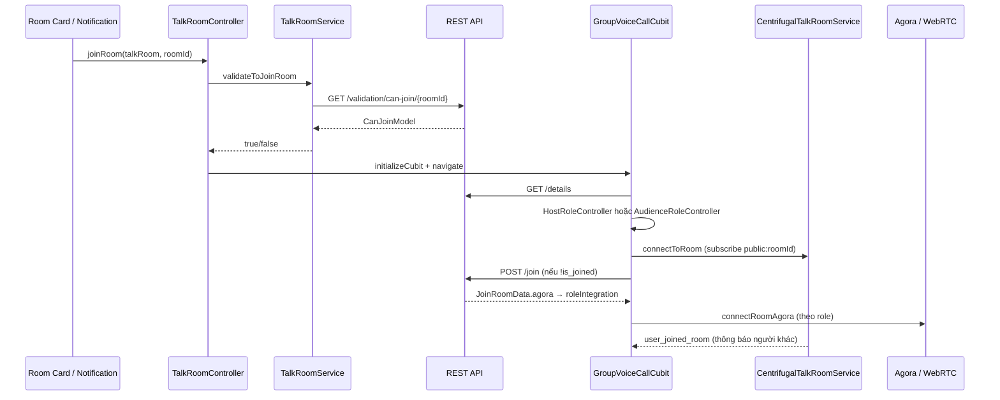
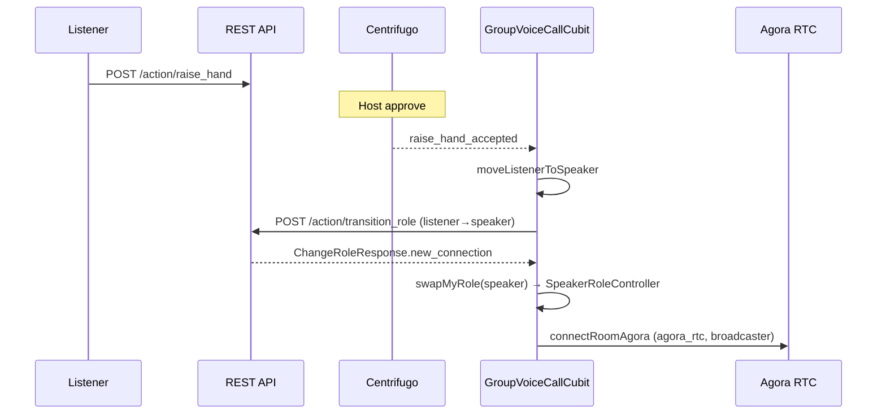

# Talk Room Join — API, Socket Event & Logic

Tài liệu mô tả toàn bộ **REST API**, **socket/SSE event** và **business logic** liên quan đến việc join talk room cho 3 vai trò: **Host**, **Speaker**, **Listener**.

---

## 1. File tham chiếu chính

| Khu vực | File |
|---------|------|
| Enums & hằng số | `lib/constant/app_constant.dart` |
| REST API definitions | `lib/data/remote/talk_room_api.dart` |
| Repository | `lib/data/repository/talk_room/talk_room_repository.dart` |
| Join response model | `lib/data/models/join_room_response.dart` |
| Can-join validation model | `lib/data/models/can_join_model.dart` |
| Role transition response | `lib/data/models/change_role_response.dart` |
| Talk room model | `lib/data/models/talk_room.dart` |
| Pre-join validation service | `lib/data/service/talk_room_service.dart` |
| SSE (home feed) | `lib/data/service/talk_room_sse_service.dart` |
| SSE event model | `lib/data/service/view_model/room_event_model.dart` |
| In-room socket (Centrifugo) | `lib/data/service/socket/centrifugal_talk_room_service.dart` |
| Socket base (legacy) | `lib/data/service/socket/base_talk_room_socket.dart` |
| Socket event model | `lib/data/service/view_model/talk_room_socket_model.dart` |
| Join orchestrator | `lib/screen/group_voice_call/controller/talk_room_controller.dart` |
| In-room cubit | `lib/screen/group_voice_call/group_voice_call_cubit.dart` |
| In-room state | `lib/screen/group_voice_call/group_voice_call_state.dart` |
| Role controllers | `lib/screen/group_voice_call/role/` |
| UI entry (room card) | `lib/widget/talk_room_card.dart` |
| Host create → join | `lib/view/create_room/create_room_bts.dart` |
| Deep link / notification | `lib/data/service/talkroom_app_link.dart`, `lib/data/service/talk_room_notification_service.dart` |

---

## 2. Enums & hằng số

### `RoomMateRole` (server / join API)

```dart
enum RoomMateRole { host, speaker, listener }
```

### `AgoraUserRole` (media session)

```dart
enum AgoraUserRole { audience, speaker, host }
```

### `ConnectionType`

```dart
enum ConnectionType { agora_rtc, media_server }
```

### `RoomUserRole` (client in-room state)

```dart
enum RoomUserRole { host, speaker, listener }
```

### `JoinRoomErrorReason`

| Giá trị | Ý nghĩa |
|---------|---------|
| `SUCCESS` | Được phép join |
| `ROOM_NOT_FOUND` | Phòng không tồn tại / đã kết thúc |
| `USER_KICKED` | User bị kick khỏi phòng |
| `USER_ALREADY_JOINED` | Đã join trước đó (rejoin) |
| `ROOM_FULL` | Phòng đầy |
| `ALREADY_IN_ANOTHER_ROOM_ACTIVE` | Đang ở phòng khác (active) |
| `ALREADY_IN_ANOTHER_ROOM` | Đang ở phòng khác |
| `ROOM_NOT_AVAILABLE` | Phòng không khả dụng |
| `ROOM_NOT_LIVE_YET` | Phòng chưa live |
| `HOST_NOT_JOINED` | Host chưa vào phòng |
| `NONE` | Không xác định |

### `HOST_TIME_TO_JOIN_FIRST`

```dart
const int HOST_TIME_TO_JOIN_FIRST = 10 * 60; // 600 giây = 10 phút
```

Dùng cho UI room card (hiển thị `readyForJoin`), **không** enforce trong `validateToJoinRoom`.

---

## 3. REST API liên quan Join

### 3.1. Pre-join validation

| Method | Path | Request | Response |
|--------|------|---------|----------|
| `GET` | `/talkroom/validation/can-join/{roomId}` | Query: `getQueryAll()` | `CanJoinModel` |

**`CanJoinModel`:**

```json
{
  "canJoin": true,
  "reason": "SUCCESS",
  "message": "optional string"
}
```

- `isRejoin` = `reason == USER_ALREADY_JOINED`

**Repository:** `talkRoomRepository.validateRoomCanJoin()` → `TalkRoomService.validateToJoinRoom()`

---

### 3.2. Join room

| Method | Path | Request | Response |
|--------|------|---------|----------|
| `POST` | `/talkroom/{roomId}/join` | Body: `getQueryAll()` | `JoinRoomResponse` |

**`JoinRoomResponse`:**

```json
{
  "success": true,
  "message": "optional",
  "data": {
    "roomate": {
      "id": "...",
      "userId": "...",
      "role": "host|speaker|listener",
      "joinedAt": "...",
      "status": "..."
    },
    "role": "host|speaker|listener",
    "isRejoining": false,
    "roomInfo": { "...TalkRoom..." },
    "socket_integration": {
      "room_subscribed": true,
      "event_broadcasted": true,
      "participants_notified": 5,
      "socket_event_details": "..."
    },
    "agora": {
      "session_id": "...",
      "connection_type": "agora_rtc|media_server",
      "role": "audience|speaker|host",
      "stream_wss_url": "https://...",
      "stream_hls_url": "https://...",
      "stream_quality": "...",
      "agora_token": "...",
      "channel_name": "...",
      "agora_uid": 12345,
      "expires_at": 1234567890
    }
  }
}
```

Client chỉ lưu `joinRoomData.agora` vào `roleIntegration` trên role controller.

---

### 3.3. Leave room

| Method | Path | Request | Response |
|--------|------|---------|----------|
| `POST` | `/talkroom/{roomId}/leave` | Body: `getQueryAll()` | `code == 200` |

---

### 3.4. Room detail (gọi trước khi join in-room)

| Method | Path | Mục đích |
|--------|------|----------|
| `GET` | `/talkroom/{roomId}/details` | Load trạng thái phòng, speakers, `is_joined`, `host_joined`, stream URLs |
| `GET` | `/talkroom/{roomId}/details/listeners` | Danh sách listener (phân trang) |

---

### 3.5. Chuyển role (sau khi đã join)

| Method | Path | Request | Response |
|--------|------|---------|----------|
| `POST` | `/talkroom/{roomId}/action/transition_role` | `{ "from_role": "listener", "to_role": "speaker" }` | `ChangeRoleResponse` |

**`ChangeRoleResponse`** chứa `new_connection: AgoraIntegration` — credentials media mới sau khi đổi role.

---

### 3.6. Socket auth

| Method | Path | Request | Response |
|--------|------|---------|----------|
| `POST` | `/auth/socket_token` | `{}` | `{ object: { socket_token } }` |

---

### 3.7. Toggle mic (host/speaker)

| Method | Path | Request |
|--------|------|---------|
| `POST` | `/talkroom/socket/{roomId}/toggle_mic` | `{ is_on: bool }` |

---

### 3.8. API hỗ trợ chuyển Listener → Speaker (không phải join ban đầu)

| Method | Path | Mô tả |
|--------|------|-------|
| `POST` | `/talkroom/{roomId}/action/raise_hand` | Listener giơ tay |
| `POST` | `/talkroom/{roomId}/action/host_approve_raise_hand` | Host duyệt/từ chối |
| `POST` | `/talkroom/{roomId}/action/invite_to_speaker` | Host mời lên speaker |
| `POST` | `/talkroom/{roomId}/action/accept_invite_to_speaker` | Listener chấp nhận |
| `POST` | `/talkroom/{roomId}/action/reject_invite_to_speaker` | Listener từ chối |
| `POST` | `/talkroom/{roomId}/action/stepdown_to_listener` | Speaker xuống listener |
| `POST` | `/talkroom/{roomId}/action/stop_hosting` | Host dừng host (khi live) |
| `POST` | `/talkroom/{roomId}/action/kick_user` | Kick user |

---

### 3.9. Agora token standalone (không dùng trong flow join chính)

| Method | Path | Request |
|--------|------|---------|
| `POST` | `/agora/token/rtc` | `{ channelName, role: "speaker" }` |

Token chính lấy từ response **join** hoặc **transition_role**.

---

## 4. Socket / SSE Events

### 4.1. SSE — Home feed (Centrifugo)

**File:** `lib/data/service/talk_room_sse_service.dart`  
**Channel:** `public:talkroom_sse` (prod) / `public:talkroom_sse_dev` (dev)

| SSE `TalkRoomType` | Client event | Liên quan join |
|--------------------|--------------|----------------|
| `created` | `NewRoomCreated` | Phòng mới xuất hiện trên list |
| `status_changed` | `UpdateTalkRoomInfo` | Phòng chuyển live / đổi status |
| `ended` | `EndTalkRoom` | Phòng kết thúc |
| `force_closed` | `EndTalkRoom` | Phòng bị force close |
| `participant_joined` | `UpdateParticipantCountRoomEvent(+1)` | Cập nhật `hostJoined`, participant count |
| `participant_left` | `UpdateParticipantCountRoomEvent(-1)` | Tương tự |
| `room_deleted` | `RoomDeleted` | Xóa khỏi list |

**`TalkRoom.updateParticipantCount()`:** set `hostJoined = true` khi host user join (`participantCount > 0`).

> SSE chỉ dùng cho **home feed / room list**. Trong phòng voice dùng Centrifugo `public:{roomId}`.

---

### 4.2. In-room socket — Centrifugo

**File:** `lib/data/service/socket/centrifugal_talk_room_service.dart`  
**Subscribe channel:** `public:{roomId}`  
**Emit channel:** `public:{roomId}` qua `emitChannel({ user_id, event, payload })`

Payload parse thành `TalkRoomSocketModel` với enum `TalkRoomSocketEvent`.

#### Events liên quan join / presence

| Event | Payload chính | Hành vi client |
|-------|---------------|----------------|
| `user_joined_room` | `user_id`, `user_info`, `target_id` | Thêm listener; nếu host join → populate host speaker slot; play sound |
| `user_left_room` | `action_details.leave_reason`, `new_status` | Xóa listener/speaker; nếu self kicked → `closeRoomInstantly()` |
| `user_joined_room_personal` | — | No-op (ack only) |
| `leave_room_confirmed` | — | No-op |
| `room_subscription_confirmed` | — | No-op |
| `room_went_live` | `room_id` | Fire `RoomChangeToLive` → bắt đầu `countWaiting` |
| `room_start_countdown` | `action_details.countDownAt` | Chuyển `countRoomLive`; host/speaker connect Agora |

#### Events chuyển role (Listener → Speaker → Host)

| Event | Hành vi |
|-------|---------|
| `promote_to_speaker` | `moveListenerToSpeaker` → `swapMyRole(speaker)` |
| `raise_hand_accepted` | Tương tự, `autoOnMic: true` |
| `listener_accept_to_speaker_success` | `moveListenerToSpeaker` |
| `speaker_auto_pushed_to_host` | `moveListenerToHost` hoặc `swapMyRole(host)` |
| `host_transferred` | Host transfer + role swap |
| `host_invite_to_speaker` | Hiện dialog mời lên speaker |
| `speaker_stepped_down` / `speaker_removed` | `swapMyRole(listener)` |

#### Events kết thúc phòng

| Event | Hành vi |
|-------|---------|
| `room_time_up` | Session end hoặc inactive timeout |
| `room_force_closed` | Force close (host leave / system) |
| `room_inactive_warning` | Toast cảnh báo |
| `room_inactive_force_closed` | Force close + leave |

#### Events mic / talking (sau join)

| Event | Payload | Hành vi |
|-------|---------|---------|
| `speaker_on_mic` | `{ is_on: bool }` | Cập nhật UI mic status |
| `speaker_off_mic` | `{ is_on: bool }` | Cập nhật UI mic status |
| `on_talking` | `{ is_talking: bool }` | Cập nhật voice activity |

#### Client emit (host/speaker)

| Event | Payload | Khi nào |
|-------|---------|---------|
| `speaker_on_mic` | `{ is_on: true }` | Bật mic |
| `speaker_off_mic` | `{ is_on: false }` | Tắt mic |
| `on_talking` | `{ is_talking: bool }` | Voice activity detected |

#### Legacy socket events (trong `BaseTalkRoomSocketService`)

Dùng nếu không qua Centrifugo path:

`listener_joined`, `listener_left`, `speaker_joined`, `speaker_left`, `speaker_added`, `speaker_removed`, `host_accept_speaker`, `room_time_up`, `room_force_closed`, `room_inactive_*`, `host_transferred`, `speaker_to_host`, `speaker_on_mic`, `speaker_off_mic`, `on_talking`

---

## 5. Điểm vào Join (Entry Points)

Tất cả UI paths hội tụ tại `TalkRoomController`:

| Entry | File | Method |
|-------|------|--------|
| Room card "Join now" / "Start" | `talk_room_card.dart` | `enterRoom()` → `TalkRoomController.joinRoom()` |
| Chat message tap | `customize_talk_room_message.dart` | `joinRoom(roomId:)` |
| Push notification / deep link | `talk_room_notification_service.dart`, `talkroom_app_link.dart` | `JoinRoomFromNotification` → `joinRoom(roomId:)` |
| Host sau khi tạo phòng | `create_room_bts.dart` | `checkMicAndJoin()` — **bỏ qua** API validation |
| App restore | `talk_room_controller.dart` | `restoreActiveRoomIfNeeded()` → `joinRoom()` |

---

## 6. Luồng Join theo Phase

### Phase A — Pre-join (`TalkRoomController.joinRoom`)

```
1. checkIsInOtherRoom(roomId)
   ├─ Đang ở cùng phòng → navigate lại (joinOldRoom)
   ├─ Đang ở phòng khác → close cubit cũ, tiếp tục (joinNewRoom)
   └─ Đang trên GroupVoiceCallRoute → block (joinOldRoom)

2. checkMicInUse() → toast nếu mic đang bận

3. talkRoomService.validateToJoinRoom(talkRoom, roomId)
   → GET /talkroom/validation/can-join/{roomId}

4. Nếu validation pass → initializeCubit() + navigateToGroupVoiceCall()
   (có thể show tutorial trước cho host/audience)
```

**`checkMicAndJoin` (host tạo phòng):**

```
1. Request mic permission
2. checkWarningBeginnerRoom
3. BỎ QUA validateToJoinRoom
4. initializeCubit + navigate
```

---

### Phase B — In-room init (`GroupVoiceCallCubit.onInit`)

```
1. GET /talkroom/{roomId}/details
2. Xác định role controller (CLIENT-SIDE):
   - hostUser.userId == myUserId → HostRoleController
   - else → AudienceRoleController (listener)
3. Subscribe chat channel
4. clubRepository.requestJoinConversation (chat)
5. Set CountTimeType dựa trên room.status, countDownAt, isHost
6. joinRoom()  ← gọi API join thực sự
7. Load raised hands + listeners list
8. connectRoomAgora() theo role và count time type
```

> **Lưu ý:** Client chọn role bằng cách so sánh `hostUser.userId`, **không** dùng `JoinRoomData.role` từ API.

---

### Phase C — API join (`GroupVoiceCallCubit.joinRoom`)

```
1. talkRoomSocketService.connectToRoom()  ← LUÔN gọi (kể cả re-enter)
   → Centrifugo subscribe public:{roomId}

2. Nếu talkRoom.isJoined == false:
   a. clubRepository.requestJoinConversation(conversationId, true)
   b. Set isJoined = true locally
   c. roleController.joinRoom()
      → POST /talkroom/{roomId}/join
      → roleIntegration = response.data.agora
      → talkRoom.isJoined = true
```

Nếu `is_joined` đã `true` từ room detail (re-enter), **bỏ qua** API join nhưng socket vẫn connect.

---

## 7. Luồng Join theo Role

### 7.1. Host

| Bước | Hành vi |
|------|---------|
| Pre-join UI | Card hiện **"Start"** khi `isYourRoom && !hostJoined`; trong 10 phút trước giờ → `readyForJoin` |
| Pre-join API | `validateToJoinRoom` (trừ `checkMicAndJoin` sau create) |
| Role controller | `HostRoleController` |
| Join API | `POST .../join` → `agora` với `userRole: host`, `connection_type: agora_rtc` |
| Socket | Subscribe `public:{roomId}`; server broadcast `user_joined_room` |
| Media | `connectRoomAgora()` khi `countRoomLive` HOẶC host bật mic trong `countWaiting` |
| Agora | `joinChannel` as `clientRoleBroadcaster`, mic on |
| Counter | `countWaiting` cho đến countdown; `WaitingListenerCounter` force-close nếu hết timer |
| Leave | `stopHosting(roomId, isLeave: true)` thay vì leave thường khi room live |

**Host bật mic trong waiting:**

```
onOffMic() khi countTimeType == countWaiting:
  → updateCounterType(countRoomLive)
  → connectRoomAgora(isOnMic: true)
```

---

### 7.2. Listener

| Bước | Hành vi |
|------|---------|
| Pre-join UI | Card `readyForJoin` khi scheduled ≤10 phút hoặc live |
| Pre-join API | `validateToJoinRoom`; **`HOST_NOT_JOINED` → vẫn cho join** (`return true`) |
| Role controller | `AudienceRoleController` |
| Join API | `POST .../join` → `agora` với `userRole: audience`, `connection_type: media_server` |
| Socket | Subscribe; nhận `user_joined_room`; nếu host join → cập nhật host speaker slot |
| Media | `connectRoomAgora()` → **WebRTC WHEP** qua `stream_wss_url` (không dùng Agora RTC) |
| Counter | `countWaiting` chờ session; lắng nghe `room_start_countdown` / `room_went_live` |
| Promotion | Raise hand / invite → `swapMyRole(speaker)` → `POST transition_role` |

**Listener không join trực tiếp với role speaker** — luôn bắt đầu là listener, được promote in-room.

---

### 7.3. Speaker

Speaker **không join trực tiếp** từ room list. Luôn được promote từ listener:

| Đường | Trigger | Flow |
|-------|---------|------|
| Raise hand accepted | Socket `raise_hand_accepted` hoặc host `approveOrDenyRaiseHand` | `moveListenerToSpeaker` → `swapMyRole(speaker)` |
| Host invite accepted | `POST accept_invite_to_speaker` + socket `listener_accept_to_speaker_success` | Tương tự |
| Auto promote | Socket `promote_to_speaker` | Tương tự |
| Host transfer | Socket `speaker_auto_pushed_to_host` / `host_transferred` | `moveListenerToHost` → `swapMyRole(host)` |

**`swapMyRole` flow:**

```
1. Dispose role controller cũ
2. Nếu listener→speaker/host HOẶC speaker→host:
   POST /talkroom/{roomId}/action/transition_role
   { from_role, to_role }
   → new AgoraIntegration trong response
3. Tạo controller mới (SpeakerRoleController / HostRoleController)
4. connectRoomAgora(newConnection, isOnMic)
```

Speaker media: giống host — Agora RTC broadcaster.

---

## 8. Ma trận Role vs Media Connection

| Role | Controller | `connection_type` | Media stack |
|------|------------|-------------------|-------------|
| Host | `HostRoleController` | `agora_rtc` | Agora RTC, broadcaster, mic on |
| Speaker | `SpeakerRoleController` | `agora_rtc` | Agora RTC, broadcaster |
| Listener | `AudienceRoleController` | `media_server` | WebRTC WHEP (`stream_wss_url`) recv-only |

Mapping `AgoraUserRole` từ join response:

- `audience` → listener
- `speaker` → speaker
- `host` → host

---

## 9. Error Handling

### 9.1. `validateToJoinRoom` (`TalkRoomService`)

| `JoinRoomErrorReason` | `canJoin` | Hành vi client |
|----------------------|-----------|----------------|
| `SUCCESS` | `true` | Tiếp tục; optional beginner warning |
| `USER_ALREADY_JOINED` | `false` | **`isRejoin` → vẫn tiếp tục** |
| `HOST_NOT_JOINED` | `false` | **Vẫn tiếp tục** (`return true`) |
| `ROOM_NOT_FOUND` | `false` | Fire `EndTalkRoom`; toast "room has ended or deleted" |
| `USER_KICKED` | `false` | `showUserKickedToast()` |
| `ROOM_FULL` | `false` | `roomFulDialog()` |
| `ALREADY_IN_ANOTHER_ROOM` | `false` | Mở `TalkRoomSheetDetailView` |
| `ALREADY_IN_ANOTHER_ROOM_ACTIVE` | `false` | Mở detail sheet |
| `ROOM_NOT_AVAILABLE` | `false` | Mở detail sheet |
| `ROOM_NOT_LIVE_YET` | `false` | Mở detail sheet |
| `NONE` / null | — | Generic error toast |

### 9.2. `TalkRoomController` local errors

| `ErrorJoinRoom` | Hành vi |
|-----------------|---------|
| `joinOldRoom` | Block hoặc re-navigate tới phòng hiện tại |
| `notJoinNewRoom` | Block (hiện không dùng) |
| `joinNewRoom` | Đóng phòng cũ, cho join phòng mới |
| Mic in use | Warning toast, block |

### 9.3. Join API failure

`BaseRoleController.joinRoom()` catch exception → set `talkRoom.isJoined = false`. Không có toast lỗi riêng.

### 9.4. In-room kick

Socket `USER_LEFT_ROOM` với `leaveReason: KICKED` → `listenerStatus = KICKED` → `closeRoomInstantly()`.

---

## 10. State Transitions

### Các field trạng thái quan trọng

| Field | Nơi set | Ý nghĩa |
|-------|---------|---------|
| `TalkRoom.isJoined` | Join API success / cubit | User đã gọi join API |
| `TalkRoom.hostJoined` | SSE `participant_joined` cho host | Host đã vào phòng (UI card) |
| `GroupVoiceCallState.roomUserRole` | `onInit` / `swapMyRole` | Role client hiện tại |
| `roleController.roleIntegration` | Join API / transition_role | Agora/media credentials |
| `CountTimeType` | `onInit`, socket events | `countWaiting` → `countRoomLive` → `countSessionEnd` |
| `recentRoomIdJoin` | `TalkRoomController` | Tracking session active + overlay |
| `keyActiveTalkRoomId` | localStorage | Persist room để restore |

### Counter transitions ảnh hưởng media connect

| Event | Counter | Media action |
|-------|---------|--------------|
| Room live, không countdown | `countWaiting` | Listener: WebRTC ngay; Host: khi bật mic |
| Socket `room_start_countdown` | `countRoomLive` | Host/speaker connect Agora |
| Host bật mic trong waiting | `countRoomLive` | `connectRoomAgora(isOnMic: true)` |
| SSE/socket `room_went_live` | `countWaiting` | Chuẩn bị session |
| Waiting timer hết (không activity) | — | `forceClosed` + leave |

---

## 11. Sequence Diagram



---

## 12. Sequence Diagram — Listener promote to Speaker



---

## 13. Ghi chú triển khai quan trọng

1. **Client chọn role lúc init** bằng so sánh `hostUser.userId`, không dùng `JoinRoomData.role` từ API join.
2. **`HOST_NOT_JOINED` bị bypass** — listener có thể vào trước host (server có thể gate riêng; client cho phép).
3. **`hostJoined` UI gating đã comment** trong `talk_room_card.dart` — validation chuyển sang API `can-join`.
4. **Socket luôn connect khi re-enter** dù `is_joined=true` — comment trong cubit: cần cho audience updates.
5. **Không có SSE trong voice room** — SSE cho home feed; in-room dùng Centrifugo `public:{roomId}`.
6. **Speaker không phải initial join role** — luôn promote từ listener qua socket events hoặc host actions.
7. **Host leave khi live** gọi `stopHosting` thay vì `leaveRoom` thông thường.
8. **Listener nghe qua WHEP** (WebRTC recv-only), không join Agora channel.

---

## 14. Tham chiếu nhanh — File đọc theo thứ tự

1. `lib/screen/group_voice_call/controller/talk_room_controller.dart` — orchestrator pre-join
2. `lib/data/service/talk_room_service.dart` — validation logic
3. `lib/screen/group_voice_call/group_voice_call_cubit.dart` — in-room init, join, socket handling
4. `lib/screen/group_voice_call/role/base_role_controller.dart` — API join call
5. `lib/screen/group_voice_call/role/audience_role_controller.dart` — listener media (WHEP)
6. `lib/screen/group_voice_call/role/base_agora_role_controller.dart` — host/speaker media (Agora)
7. `lib/data/service/socket/centrifugal_talk_room_service.dart` — in-room socket
8. `lib/data/service/talk_room_sse_service.dart` — home feed SSE
